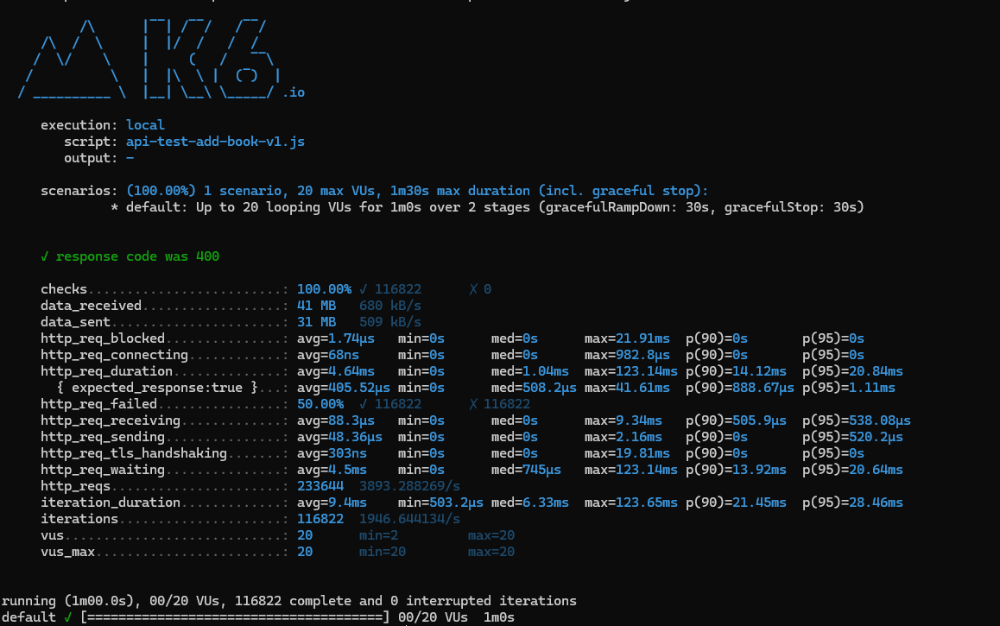
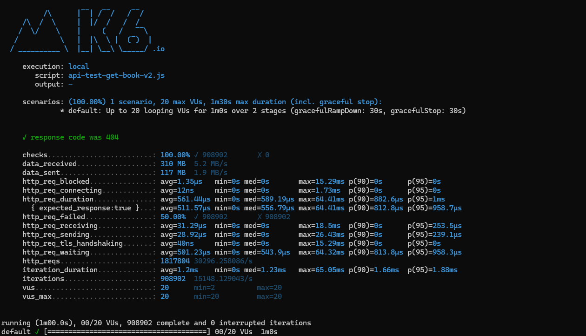
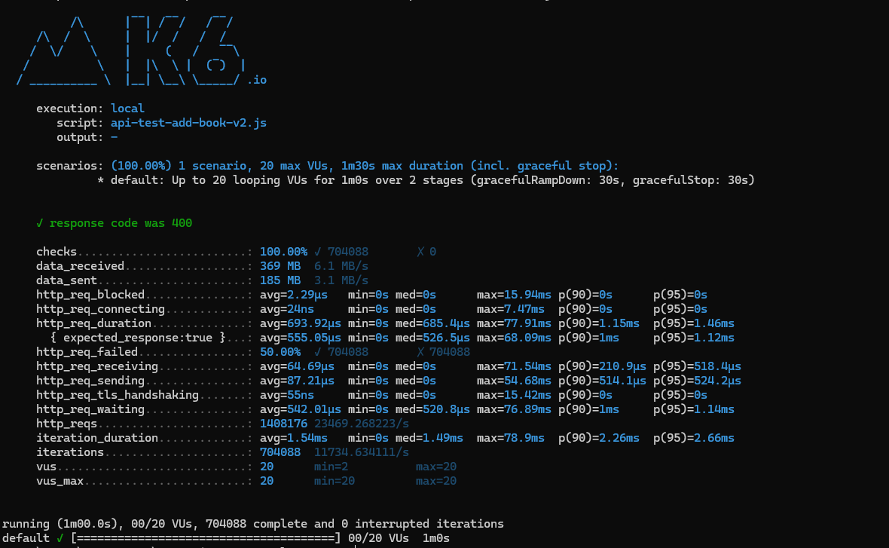

# Exceptions Vs Result Pattern

Exercise to investigate how costly are exceptions comparing them against a Result Pattern

## Description

Having two endpoints that do the same thing, one using exceptions and the other using a Result Pattern, we will compare the performance of both.

## Test Scenarios

1. We simulate ramp-up of traffic from 1 to 20 users over 10 seconds.
2. Stay at 20 users for 50 seconds 

## Results

### Get unexisting book using Exceptions

Around 4228 request per second

### Try add a book with invalid data using Exceptions

Around 3893 request per second

---

### Get unexisting book using Result Pattern

Around 30296 request per second. 7 times faster than Exceptions scenario

### Try add a book with invalid data using Result Pattern

Around 23469 request per second. 6 times faster than Exceptions scenario

